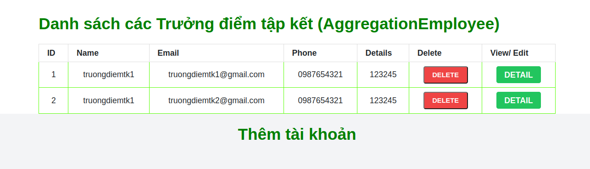
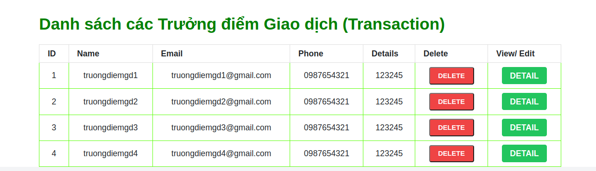
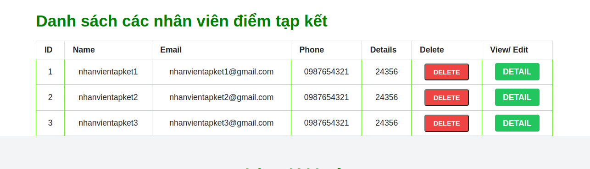
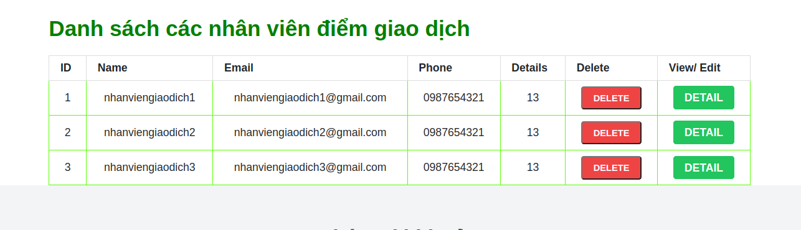

sau khi chay docker compose up -d
docker exec -it appForPostman /bin/bash
php artisan key:generate
php artisan config:cache
chuyển qua dbForPostman
docker exec -it dbForPostman /bin/bash
mysql -u root -p -> pass: "root"
GRANT ALL ON laravel_web.* TO 'root'@'%' IDENTIFIED BY '140903';
FLUSH PRIVILEGES;
sau đó thóat ra kiểm tra phpmyadmin được chưa.

//
pass 12345678:

# tài khoản lãnh đạo công ty

`thanh@gmail.com`
vào
tài khoản trưởng điểm tập kết

tài khoản trưởng điểm giao dịch

# sau đó đăng nhập vào trang của trưởng điểm tập kết

ví dụ đây là trang của trưởng điểm tập kết 1 mới có 3 tài khoản như này, còn với những điểm tập kết khác phải thêm

# sau đó đăng nhập vào trang của trưởng điểm giao dịch

ví dụ với tài khoản trưởng điểm giao dịch 1 thì đã tạo 3 tài khoản

còn với các tài khoản khác thì chưa có nhân viên giao dịch nào khi đăng nhập.
